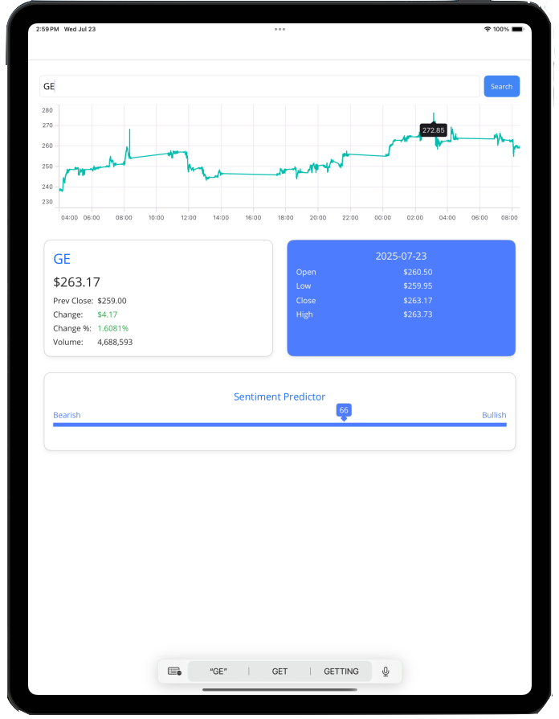
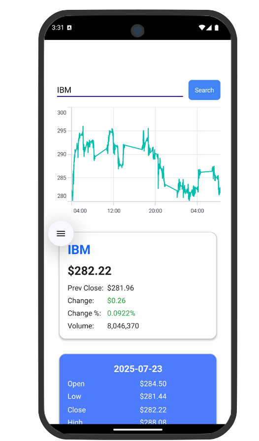

String Stats is a cross-platform stock dashboard built using .NET MAUI and Syncfusion charting components. It allows users to search for stock symbols, view and analyze intraday price movements.

---

  
  

---

## Features

- Real-time stock lookup by symbol
- Intraday line chart with 5-minute interval price data
- Sentiment predictor ranging from Bearish to Bullish
- Display of open, high, low, and close prices
- Volume and price change statistics
- Responsive layout designed for tablets and mobile

---

## API Integration
This project originally used the WSDL ASU Service-Oriented Computing API for mock data. It has since been upgraded to use the [Alpha Vantage INTRADAY API](https://www.alphavantage.co/documentation/#intraday) to access real-time and historical intraday stock data.

---
[Source Code](https://github.com/airtimeEnthusiast/StockViewer)